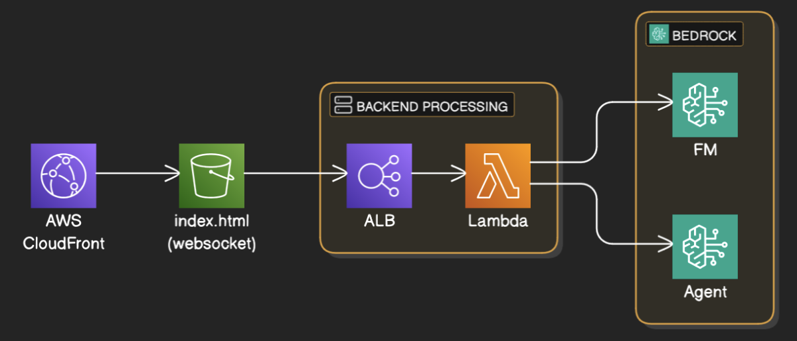

# Agent Client Chatbot

A WebSocket-based chatbot application using AWS Bedrock Agent or Foundation Models, implemented with AWS Lambda and Application Load Balancer.

## Architecture



The application follows this flow:
1. CloudFront distributes the static website (index.html)
2. WebSocket connection established through Application Load Balancer
3. Lambda function processes the requests
4. Bedrock Agent / FM handles the chat interactions

## Prerequisites

- AWS Account
- Terraform installed
- AWS CLI configured
- Python 3.x
- ZIP utility

## Project Structure

```
.
├── data/
│   └── architecture.png
├── frontend/
│   ├── agent_architecture.png
│   └── index.html
├── lambda/
│   └── app.py
├── terraform/
│   └── main.tf
└── README.md
```

## Deployment Instructions

1. Navigate to the project directory:

2. Package the Lambda function:
```bash
cd lambda
zip -r ../terraform/lambda.zip app.py
```

3. Deploy the infrastructure using Terraform:
```bash
cd ../terraform
terraform init
terraform apply
```

4. Update the WebSocket URL:
- After terraform deployment completes, note the `websocket_url` output value
- Update this value in the `index.html` file

5. Upload the index.html into S3 bucket, which acts as a CloudFront origin.

## Configuration

The application requires the following configuration:
- AWS credentials properly configured
- Appropriate IAM permissions for Lambda and Bedrock Agent/FM
- WebSocket URL in the frontend code

## Development

- The Lambda function code is in `lambda/app.py`
- Infrastructure as Code is managed through Terraform in the `terraform/` directory
- Frontend code is served through CloudFront from S3

## Notes

- Make sure to update the WebSocket URL in index.html if you changed the websocket URL
- The system uses WebSocket for real-time communication
- Bedrock Agent handles the chat processing

## Clean Up

To remove all deployed resources:
```bash
cd terraform
terraform destroy
```
